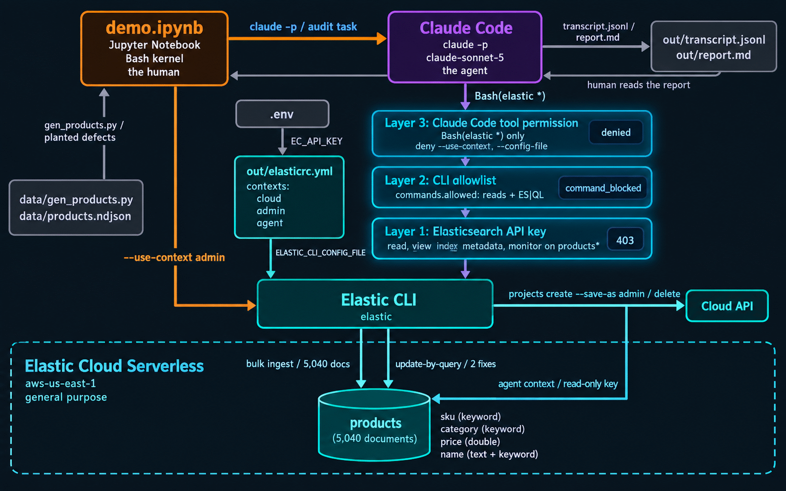
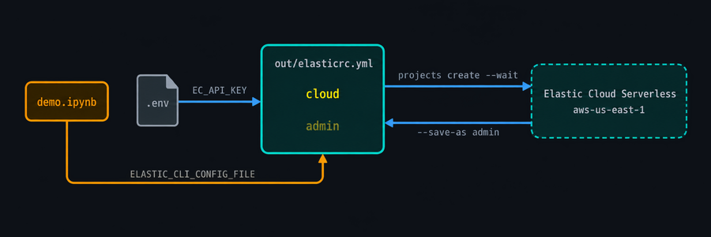
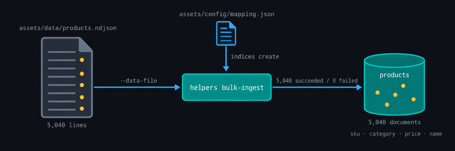
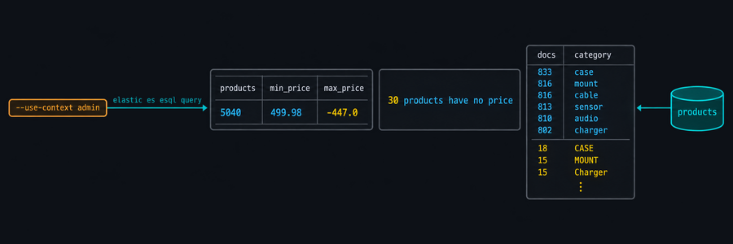
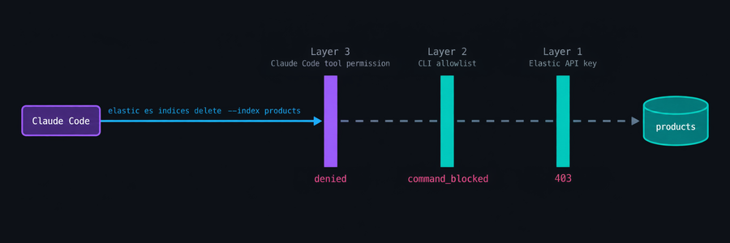
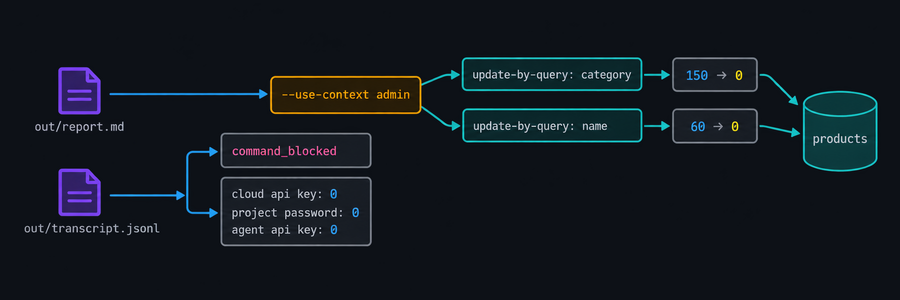

# Least Privilege for AI Agents, with the Elastic CLI
*Three permission layers give an AI agent exactly the Elasticsearch access its task needs, and the Elastic CLI is where you set them.*

This article covers the [Elastic CLI](https://www.elastic.co/docs/reference/elastic-cli), a unified interface to the Elasticsearch, Kibana, and Cloud APIs for humans and agents. The demo is a product catalog use case with both human and agentic interaction with the CLI. On the agentic front, I show how to restrict the agent's CLI access at three different layers.

---

## What This Article Covers

- Creation of an Elastic Cloud Serverless project via the CLI (human)
- Creation of an Elasticsearch index, bulk loading, and search via the CLI (human)
- Demonstration of how to create multi-layered agent restrictions (human)
- Use of the CLI in conjunction with an agent to audit data quality and create a report (agent)
- Use of the CLI to make the associated corrections (human)


---

## Business Value
- **One tool for people and agents.** The human and the agent run the same `elastic` binary with the same commands, so nothing is built or maintained separately for automation, and every skill a person learns transfers.
- **Access is a policy setting, not a code change.** What an agent may do is a few lines of `commands.allowed` on a context, enforced inside the binary before any request leaves the machine. Widening it from audit to repair is a reviewable config edit.
- **Credentials never enter the model.** The CLI resolves secrets from its config file, so the agent uses the project without ever seeing a key, and the transcript proves it.
- **Every action is a readable record.** The agent's work and its proposals are literal `elastic` commands, so reviewing means reading commands you already know and applying a fix means running one.

---

## Architecture


---

## Provisioning


In the spirit of the CLI, this entire demo is performed from a Bash kernel within a Jupyter notebook.
- An Elastic Cloud API key is loaded from `.env`.
- A CLI context named `cloud`, holding the Elastic Cloud API key, is stored in `out/elasticrc.yml`.
- That context is then used to build a Serverless project.
- That project's context (`admin`) is also stored in `out/elasticrc.yml`. This context has no restrictions.
- The human in this demo uses this context from here on via `--use-context admin`.

***CLI Commands***
```bash
export ELASTIC_CLI_CONFIG_FILE="$PWD/out/elasticrc.yml"

echo "--- cloud context: where the Cloud API key was stored"
elastic config context add cloud \
  --cloud-url https://api.elastic-cloud.com \
  --cloud-api-key "$EC_API_KEY" \
  --force --json \
  | jq "{context, action, secret_storage: [.secrets[].storage]}"

echo; echo "--- create project (progress on stderr, result saved to out/project.json)"
cat assets/config/project.json
elastic cloud serverless projects search create \
  --input-file assets/config/project.json \
  --wait --save-as admin --force --yes \
  --json --output-fields id,name,region_id,endpoints \
  | tee out/project.json
```

---

## Load the Catalog


- `assets/data/products.ndjson` holds 5,000 products, plus 40 exact duplicates, with defects planted along the way: missing and negative prices, `category` values in mixed case, and names with stray whitespace. The agent has to find these defects later on.
- The `products` index is created from `assets/config/mapping.json` with sensible types.
- `helpers bulk-ingest` loads the `products.ndjson` file with batching and retries and prints a summary.

***mapping.json***
```json
{
  "index": "products",
  "mappings": {
    "properties": {
      "sku":         { "type": "keyword" },
      "name":        { "type": "text", "fields": { "keyword": { "type": "keyword" } } },
      "category":    { "type": "keyword" },
      "price":       { "type": "double" },
      "in_stock":    { "type": "boolean" },
      "description": { "type": "text" },
      "updated_at":  { "type": "date" }
    }
  }
}
```

***CLI Commands***
```bash
echo "--- the catalog: line count, then first two documents"
wc -l assets/data/products.ndjson
head -n 2 assets/data/products.ndjson

echo; echo "--- create products (replacing any copy from an earlier run)"
elastic es indices delete --index products --use-context admin --yes --ignore-unavailable --json >/dev/null
elastic es indices create --input-file assets/config/mapping.json --use-context admin --json

echo; echo "--- bulk ingest summary"
elastic es helpers bulk-ingest --index products --data-file assets/data/products.ndjson \
  --use-context admin --json --output-fields total,succeeded,failed
```

***Output***
```text
--- the catalog: line count, then first two documents
5040 assets/data/products.ndjson
{"sku": "GH-4546-Z", "name": "Umbrella charger Z4546", "category": "charger", "price": 256.37, "in_stock": true, "description": "Charger unit, model GH-4546-Z. Ships in 2-3 business days.", "updated_at": "2026-03-26T16:00:00Z"}
{"sku": "GH-3579-Z", "name": "Acme cable Z3579", "category": "cable", "price": 226.05, "in_stock": false, "description": "Cable unit, model GH-3579-Z. Ships in 2-3 business days.", "updated_at": "2026-01-20T12:00:00Z"}

--- create products (replacing any copy from an earlier run)
{"acknowledged":true,"shards_acknowledged":true,"index":"products"}

--- bulk ingest summary
Progress: 5040 succeeded, 0 failed, 5040 total
{"total":5040,"succeeded":5040,"failed":0}
```
---

## Explore by Hand


- This shows some human interaction with the data. `--use-context admin` provides an unrestricted context.
- The data defects are clearly visible:
    - negative product prices
    - products with no price whatsoever
    - a miscount of categories. There should be six, but there are far more due to mixed case.

***CLI Commands***
```bash
echo "--- ES|QL: the catalog at a glance"
elastic es esql query --use-context admin --format tsv \
  --query "FROM products | STATS products = COUNT(*), min_price = MIN(price), max_price = MAX(price), avg_price = ROUND(AVG(price), 2)"

echo; echo "--- search: how many products have no price? (--output-template formats the answer)"
elastic es search --index products --use-context admin --size 0 \
  --query "{\"bool\":{\"must_not\":{\"exists\":{\"field\":\"price\"}}}}" \
  --output-template "{{ hits.total.value }} products have no price"

echo; echo "--- ES|QL: documents per category. This should be six rows."
elastic es esql query --use-context admin --format tsv \
  --query "FROM products | STATS docs = COUNT(*) BY category | SORT docs DESC"
```

***Output***
```text
--- ES|QL: the catalog at a glance
products	min_price	max_price	avg_price
5040	-447.0	499.98	249.52

--- search: how many products have no price? (--output-template formats the answer)
30 products have no price

--- ES|QL: documents per category. This should be six rows.
docs	category
833	case
816	mount
816	cable
813	sensor
810	audio
802	charger
18	CASE
15	MOUNT
15	Charger
15	SENSOR
14	CHARGER
14	Mount
13	Cable
13	AUDIO
11	Case
10	Sensor
7	Audio
5	CABLE
```
---

## Leash the Agent


- Below, I create three layers of access control for the agent and show proof that each one engages:
    - **Layer 1, Elasticsearch**: a read-only API key. `assets/config/agent-key.json` describes a role
that grants `read`, `view_index_metadata`, and `monitor` on `products*`, plus cluster
`monitor` so `elastic status` works, and nothing else. Proof: a delete as `agent` comes back from Elasticsearch as a 403. With no other control in place, the server itself refuses.
    - **Layer 2, the CLI**: a command allowlist. One `yq` edit attaches `commands.allowed` from
`assets/config/agent-policy.yml` to the `agent` context. The list names reads and ES|QL only, and
a context's list replaces the root list entirely. Then `agent` is made the current context,
so every bare `elastic` call, the only kind the agent will be able to make, runs as `agent`.
Proof: the same delete now fails inside the binary with a structured `command_blocked`
error and exit code 1, before any request is sent. Layer 1 never gets to see it.
    - **Layer 3, Claude Code**: tool permissions. This one lives on the `claude` command line
below. `--tools Bash` makes Bash the agent's only tool. `--allowedTools
"Bash(elastic *)"` pre-approves commands that start with `elastic`; in headless mode
anything else is denied. Two `--disallowedTools` rules deny any `elastic` command carrying
`--use-context` or `--config-file`, so the agent cannot reach `admin` or a config of its
own. Proof: the same delete, sent through Claude Code with `--use-context admin`, is denied
before the `elastic` binary is ever invoked.
- With the leash in place, the agent runs:
    - Claude Code runs headless on a task defined in `assets/prompts/audit.md`: audit the catalog and fix what can be fixed mechanically.
    - The full transcript goes to `out/transcript.jsonl`, and the final message, the report, is saved to `out/report.md`.


### Layer 1
***agent-key.json***
```json
{
  "name": "leashed-agent-agent",
  "role_descriptors": {
    "products_read_only": {
      "cluster": ["monitor"],
      "indices": [
        {
          "names": ["products*"],
          "privileges": ["read", "view_index_metadata", "monitor"]
        }
      ]
    }
  }
}
```
***CLI Commands***
```bash
echo "--- layer 1: read-only API key, minted as admin (id and name only)"
AGENT_KEY=$(elastic es security create-api-key --input-file assets/config/agent-key.json --use-context admin --json)
jq "{id, name}" <<<"$AGENT_KEY"

echo; echo "--- agent context: project endpoint plus the read-only key"
elastic config context add agent \
  --es-url "$(jq -r .endpoints.elasticsearch out/project.json)" \
  --es-api-key "$(jq -r .encoded <<<"$AGENT_KEY")" \
  --force --json | jq "{context, action, secret_storage: [.secrets[].storage]}"

echo; echo "--- proof of layer 1: a delete as agent is refused by Elasticsearch"
elastic es indices delete --index products --use-context agent --yes --json 2>&1 \
  | jq -c ".error | {code, status: .status_code, message: .body.error.reason}"
```
***Output***
```text
--- layer 1: read-only API key, minted as admin (id and name only)
{
  "id": "zYiTu6AB_BDQtjgD-Udo",
  "name": "leashed-agent-agent"
}

--- agent context: project endpoint plus the read-only key
{
  "context": "agent",
  "action": "added",
  "secret_storage": [
    "inline"
  ]
}

--- proof of layer 1: a delete as agent is refused by Elasticsearch
{"code":"transport_error","status":403,"message":"action [indices:admin/delete] is unauthorized for API key id ...
```

### Layer 2
***CLI Commands***
```bash
echo "--- layer 2: command allowlist attached to the agent context, which becomes the default"
yq -i ".contexts.agent.commands = (load(\"assets/config/agent-policy.yml\") | ... comments = \"\")" out/elasticrc.yml
elastic config current-context set agent --json
yq ".contexts.agent.commands.allowed" out/elasticrc.yml

echo; echo "--- proof of layer 2: the same delete, as a bare call, is refused by the CLI before any request is sent"
elastic es indices delete --index products --yes --json 2>&1 \
  | jq -c ".error | {code, message}"
echo "exit code: ${PIPESTATUS[0]}"
```

***Output***
```text
--- layer 2: command allowlist attached to the agent context, which becomes the default
{"configFile":"/home/joey/Dev/leashed-agent/out/elasticrc.yml","current":"agent","warnings":[]}
- version
- status
- docs.*
- sanitize.*
- config.context.list
- config.current-context.get
- stack.es.info
- stack.es.count
- stack.es.search
- stack.es.msearch
- stack.es.get
- stack.es.mget
- stack.es.field-caps
- stack.es.esql.*
- stack.es.indices.get
- stack.es.indices.exists
- stack.es.indices.get-mapping
- stack.es.indices.get-settings
- stack.es.indices.get-alias
- stack.es.indices.resolve-index
- stack.es.indices.stats
- stack.es.cat.indices
- stack.es.cat.count
- stack.es.helpers.scroll-search
- stack.es.helpers.msearch

--- proof of layer 2: the same delete, as a bare call, is refused by the CLI before any request is sent
{"code":"command_blocked","message":"command \"stack.es.indices.delete\" is not allowed by the current policy"}
exit code: 1
```

### Layer 3
***CLI Commands***
```bash
echo "--- proof of layer 3: the same delete, through Claude Code with --use-context admin, is denied before the binary runs"
claude -p "Run exactly this command and report the result: elastic es indices delete --index products --use-context admin --yes --json" \
  --tools Bash \
  --allowedTools "Bash(elastic *)" \
  --disallowedTools "Bash(elastic * --use-context *)" "Bash(elastic * --config-file *)" \
  --model claude-sonnet-5 --max-turns 3 \
  --output-format stream-json --verbose \
  | jq -r "select(.type==\"user\") | .message.content[]? | select(.type==\"tool_result\") | .content | if type==\"array\" then map(.text // \"\") | join(\"\") else tostring end"
```
***Output***
```text
--- proof of layer 3: the same delete, through Claude Code with --use-context admin, is denied before the binary runs
Permission to use Bash with command elastic es indices delete --index products --use-context admin --yes --json has been denied.
```

### Agent Run
***CLI Commands***
```bash
echo "--- agent run: prose as it arrives (full transcript in out/transcript.jsonl)"
claude -p "$(cat assets/prompts/audit.md)" \
  --tools Bash \
  --allowedTools "Bash(elastic *)" \
  --disallowedTools "Bash(elastic * --use-context *)" "Bash(elastic * --config-file *)" \
  --model claude-sonnet-5 --max-turns 30 \
  --output-format stream-json --verbose \
  | tee out/transcript.jsonl \
  | jq -r --unbuffered "select(.type==\"assistant\") | .message.content[]? | select(.type==\"text\") | .text"

echo; echo "--- report saved"
jq -r "select(.type==\"result\") | .result" out/transcript.jsonl > out/report.md
wc -l out/report.md
jq -r "select(.type==\"result\") | \"turns: \\(.num_turns)  duration: \\(.duration_ms / 1000 | floor)s  cost_usd: \\(.total_cost_usd * 100 | round / 100)\"" out/transcript.jsonl
```
***Output***
```text
Products Index Data Quality Audit

Summary

Audited all 5,040 documents in `products` using read-only ES|QL queries via the `elastic` CLI (`agent` context). Found four defect classes: exact-duplicate documents, missing/negative prices, inconsistent `category` casing, and leading/trailing whitespace in `name`. I identified safe, deterministic mechanical fixes for two of them (category casing normalization and name trimming) and constructed a verified `update-by-query` command to apply both in a single pass — but the command was refused by CLI policy (`command_blocked`) before it reached Elasticsearch, so **no data was changed**. Duplicate documents and price defects require a human decision (see below) and were not attempted. All findings below are counts and examples only; no per-document IDs were looked up for the duplicates per the audit's scope rules.

Defect Classes

1. Duplicate SKUs (exact duplicates)
- **40 SKUs** appear more than once, accounting for **80 documents** (all pairs; confirmed 0 duplicate groups have differing `name`/`price` across their copies — they are byte-for-byte content duplicates, not just same-SKU-different-data).
- Examples:
  | sku | name | category | price |
  |---|---|---|---|
  | AB-2284-Z | Initech cable Z2284 | cable | 333 |
  | AB-2681-Z | Acme case Z2681 | case | 403.91 |
  | AB-2789-X | Vandelay audio X2789 | audio | 88.2 |

2. Missing prices
- **30 documents** have a `null` `price`.
- Examples: `EF-4426-X` (Vandelay sensor X4426), `GH-2473-Y` (Initech charger Y2473), `JK-1737-Z` (Umbrella case Z1737).

3. Negative prices
- **12 documents** have a negative `price` (0 have `price == 0`).
- Examples: `GH-4393-Z` → -177.48, `GH-2386-Y` → -447, `JK-1982-Y` → -417.44.

4. Inconsistent `category` casing
- Canonical set is 6 values (`audio`, `cable`, `case`, `charger`, `mount`, `sensor`), but **150 documents** carry `UPPERCASE` or `Capitalized` variants instead of lowercase (no misspellings beyond casing — confirmed only 18 distinct raw values map to exactly 6 lowercase forms).
- Examples: `AB-1974-Z` → `Case`, `AB-1994-X` → `SENSOR`, `AB-2171-Z` → `Audio`.

5. Leading/trailing whitespace in `name`
- **60 documents** have `name` values with leading and/or trailing whitespace.
- Examples: `AB-1131-Z` → `"  Acme cable Z1131   "`, `AB-1706-X` → `"  Globex charger X1706 "`, `AB-2133-Y` → `"  Vandelay mount Y2133 "`.

Proposed Fixes (verified against `--help`, blocked before execution)

I confirmed exact flags with `elastic es update-by-query --help`, then attempted the following, which combines the category-casing and name-whitespace fixes into one script (no-op for unaffected docs, so it only touches the 150 + 60 documents — some overlap possible):

elastic es update-by-query --index products --query '{"match_all":{}}' --script '{"lang":"painless","source":"boolean changed = false; if (ctx._source.category != null) { String lc = ctx._source.category.toLowerCase(); if (lc != ctx._source.category) { ctx._source.category = lc; changed = true; } } if (ctx._source.name != null) { String t = ctx._source.name.trim(); if (t != ctx._source.name) { ctx._source.name = t; changed = true; } } if (!changed) { ctx.op = \"noop\"; }"}'


Result: refused at the CLI layer before any request was sent:

{"error":{"code":"command_blocked","message":"command \"stack.es.update-by-query\" is not allowed by the current policy"}}

Per the audit rules, I did not retry it or look for an alternate command (e.g. `bulk`, `update`, `index`) to achieve the same effect. This exact command is ready for an operator running under the `admin` context to apply.

Needs a Human Decision

- Duplicate documents (80 docs / 40 SKUs). These are exact duplicates, so no data is "wrong" to fix — the decision is which copy to keep and whether to dedup via `delete-by-query`, `reindex` into a fresh index, or a manual review. Per audit scope, I did not investigate individual document IDs or propose a deletion query, since a `delete-by-query` matching on `sku` alone would delete *all* copies, not just the extras — this needs an operator to choose a tie-breaking strategy (e.g., keep lowest `_id`, keep most recent `updated_at`).
- Missing prices (30 docs). There is no source-of-truth value to mechanically derive from the document; setting a placeholder (e.g., 0) would itself be a data-quality defect. Needs pricing input from the catalog owner.
- Negative prices (12 docs). Could plausibly be a sign-entry error (flip to positive) or could reflect corrupted/unrelated data — I can't safely infer intent, so I did not construct a "fix" script for these. An operator should confirm whether `abs(price)` is the correct correction before any script is run against them.

--- report saved
56 out/report.md
turns: 23  duration: 163s  cost_usd: 0.63
```

---

## Apply the Fixes


- From the transcript, I show where the agent attempted to perform a fix itself. That was `command_blocked` at layer 2.
- Also from the transcript, I show that no credentials were accessed by the agent.
- The two defects that can be corrected mechanically are addressed by the human via `--use-context admin`.
- The remaining three defects, duplicates and missing or negative prices, need a data owner's judgment and are deliberately left for one.

***CLI Commands***
```bash
echo "--- before acting, two receipts from the transcript: the wall the agent hit (layer 2)"
jq -r "select(.type==\"user\") | .message.content[]? | select(.type==\"tool_result\") | (.content | if type==\"array\" then map(.text // \"\") | join(\"\") else tostring end) | select(test(\"command_blocked\"))" out/transcript.jsonl

echo; echo "--- and no credential string anywhere in it (all must be 0)"
echo "cloud api key: $(grep -c -F "$EC_API_KEY" out/transcript.jsonl)"
echo "project password: $(grep -c -F "$(yq .contexts.admin.elasticsearch.auth.password out/elasticrc.yml)" out/transcript.jsonl)"
echo "agent api key: $(grep -c -F "$(yq .contexts.agent.elasticsearch.auth.api_key out/elasticrc.yml)" out/transcript.jsonl)"

echo; echo "--- before: documents with miscased category, then with untrimmed name"
elastic es esql query --use-context admin --format tsv --query "FROM products | WHERE TO_LOWER(category) != category | STATS docs = COUNT(*)"
elastic es esql query --use-context admin --format tsv --query "FROM products | WHERE name != TRIM(name) | STATS docs = COUNT(*)"

echo; echo "--- fix 1: lowercase category"
elastic es update-by-query --index products --use-context admin --refresh true --json \
  --query "{\"bool\":{\"must_not\":[{\"terms\":{\"category\":[\"audio\",\"cable\",\"case\",\"charger\",\"mount\",\"sensor\"]}}]}}" \
  --script "{\"source\":\"ctx._source.category = ctx._source.category.toLowerCase()\",\"lang\":\"painless\"}" \
  --output-fields total,updated,failures

echo; echo "--- fix 2: trim name"
elastic es update-by-query --index products --use-context admin --refresh true --json \
  --query "{\"regexp\":{\"name.keyword\":\" .*|.* \"}}" \
  --script "{\"source\":\"ctx._source.name = ctx._source.name.trim()\",\"lang\":\"painless\"}" \
  --output-fields total,updated,failures

```

***Output***
```text
--- before acting, two receipts from the transcript: the wall the agent hit (layer 2)
Exit code 1
{"error":{"code":"command_blocked","message":"command \"stack.es.update-by-query\" is not allowed by the current policy"}}

--- and no credential string anywhere in it (all must be 0)
cloud api key: 0
project password: 0
agent api key: 0

--- before: documents with miscased category, then with untrimmed name
docs
150

docs
60

--- fix 1: lowercase category
{"total":150,"updated":150,"failures":[]}

--- fix 2: trim name
{"total":60,"updated":60,"failures":[]}
```
---


## Summary

- The Elastic CLI provides a unified access pattern to the Elastic APIs for humans and agents.
- Agent access to that CLI can be restricted at multiple layers.
- Mixed-mode use of the CLI lets the agent do the reading and reasoning while keeping the human in the loop on decisions about writes.

---

## Source

Full source code on [GitHub](https://github.com/joeywhelan/leashed-agent).

---